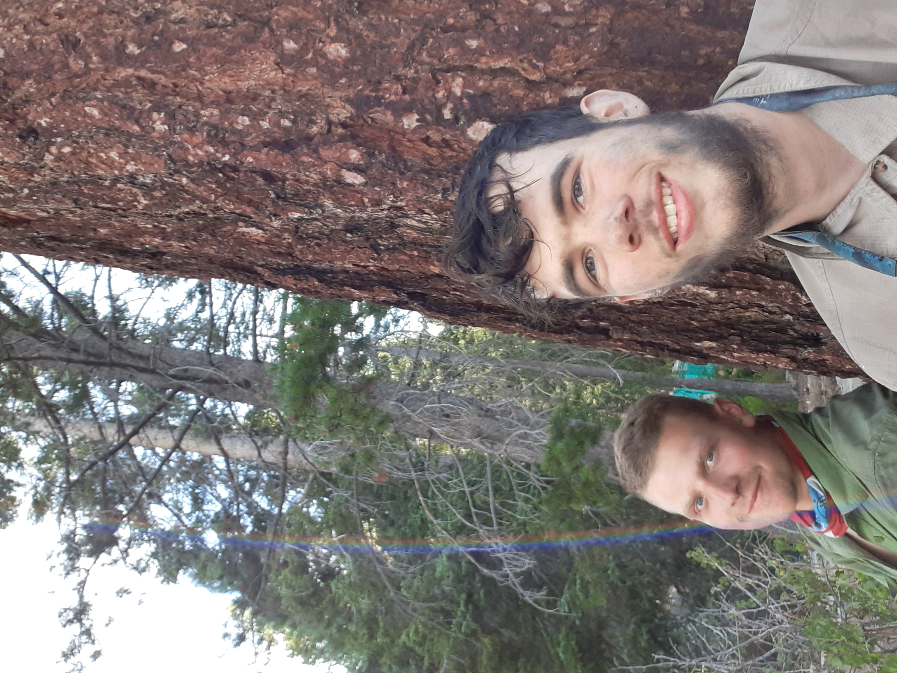
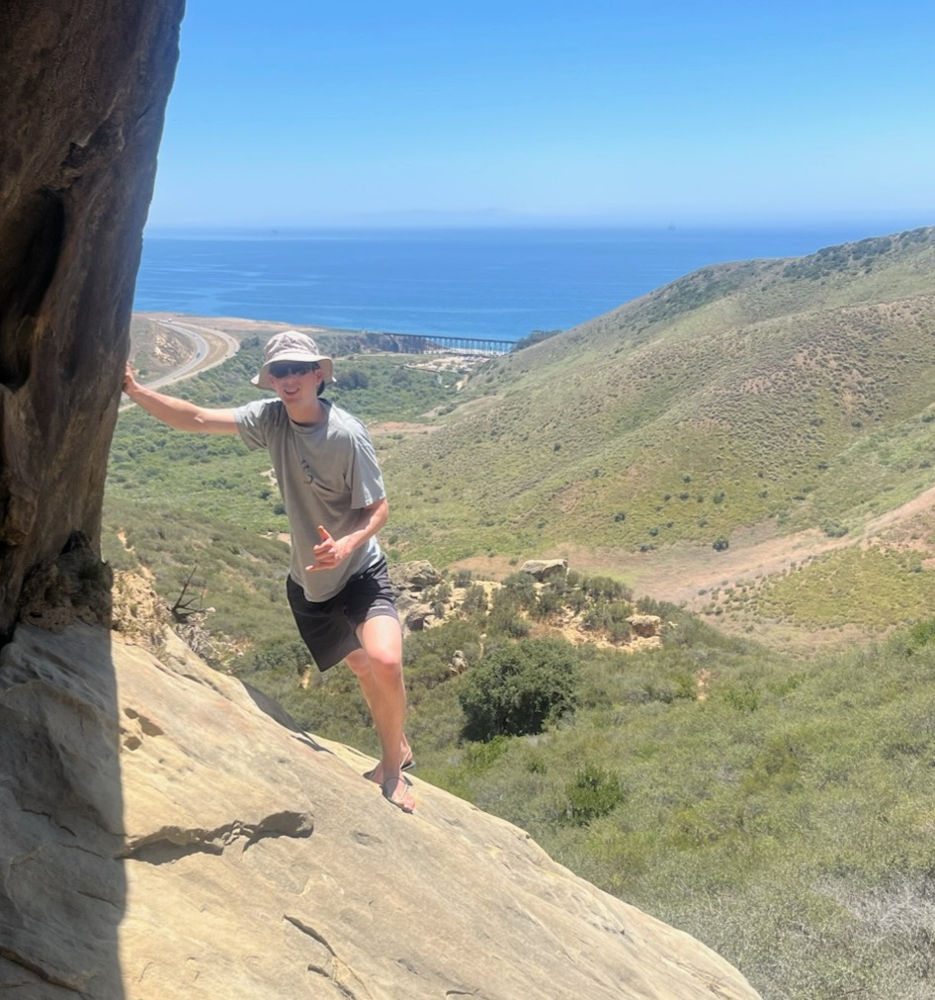

# Hi, I'm Evan Bledsoe 👋

**Business Operations Intern**

--------

## 🔗 Personal Links
- 💼 LinkedIn: [LinkedIn](https://www.linkedin.com/in/evan-bledsoe-52615a333/)
  
## 👤 About Me
Hi, my name is Evan Bledsoe! I am currently a student at the University of California, Davis studying Managerial Economics and Spanish. I previously worked at Dos Coyotes Border Cafe, a Southwestern-Mexican fusion restaurant, for over 3 years where I gained customer service skills and leadership qualities working as an assistant manager. Born and raised in Davis, California, I enjoy cruising on my bike, practicing yoga, and spending time in nature at nearby mountains, lakes, creeks and rivers.

## 💼 Work Style
I thrive in collaborative environments where ideas flow freely, teammates support one another, and solutions are found together. I bring a methodical approach to my work, which keeps me organized, focused, and efficient with my time. Ultimately, I work with purpose: I'm driven by the desire to make a meaningful impact and leave every project feeling fulfilled.

## 📬 How to Communicate With Me
- 📧 Email: evan.bledsoe@liatrio.com
- 💬 Slack: @evan

## 💪 Strengths
- Detail-oriented and driven — I take my work seriously and follow through
- Quick to pick up feedback and run with it
- I show up fully and get things done

## 🌱 Weaknesses / Challenges
- I can move fast and go deep on things, which sometimes means I need to slow down and pace myself
- Still building my comfort with new tech, but I'm on it and improving every week

## 📷 Moments with Friends

**12 days on the trail** — Finally reaching Huntington Lake after a backpacking adventure (🍦 ice cream stop!)

---

**UCSB visit** — Hanging with my friend down the coast

